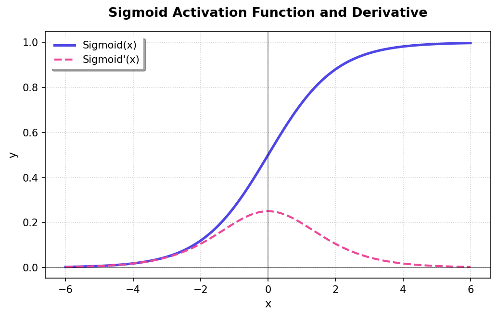
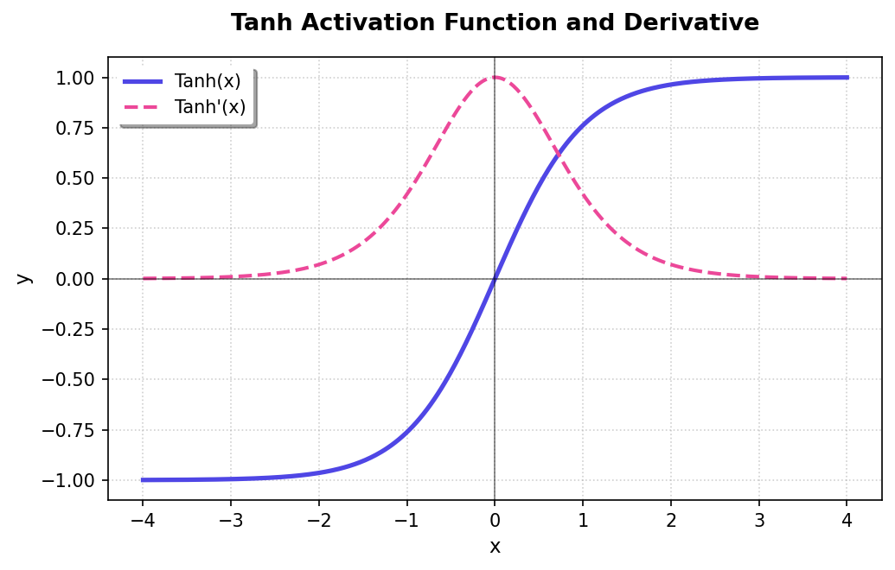
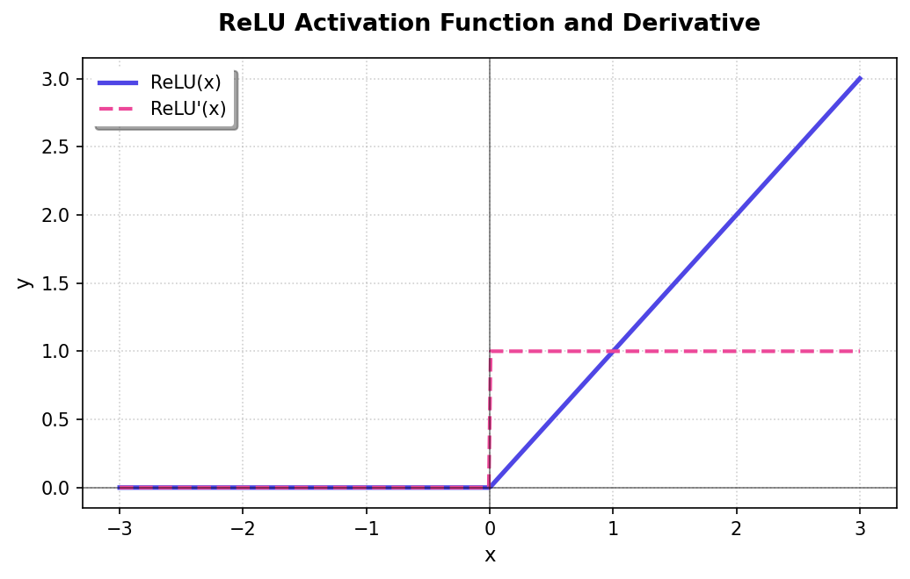
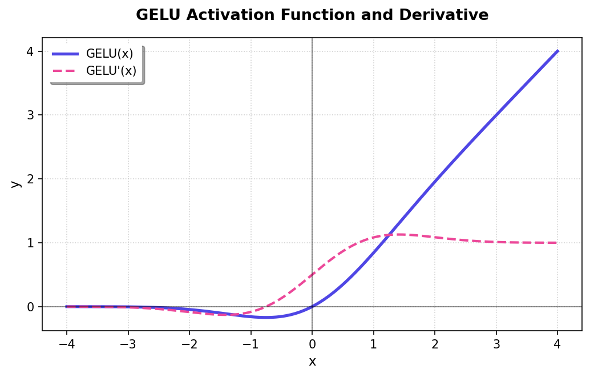
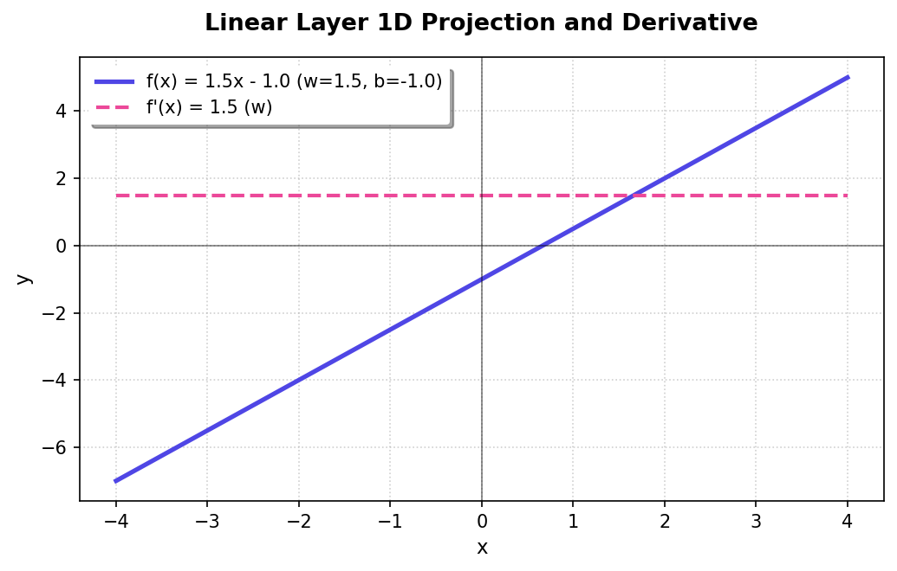

**Sigmoid**

| Description & Formula | Activation Plot |
| :--- | :---: |
| Mainly for binary classification at the output layer. It squashes everything into $[0, 1]$, but it is a nightmare for deep networks because gradients saturate (vanish) at the tails.  **Formula:** $f(x) = \frac{1}{1 + e^{-x}}$  **Derivative:** $f'(x) = f(x)(1 - f(x))$ |  |

---

**Tanh**

| Description & Formula | Activation Plot |
| :--- | :---: |
| The zero-centered upgrade to Sigmoid. Since its range is $[-1, 1]$, it keeps the data mean closer to zero, which helps convergence. Still saturates if $x$ is too high or too low, though.  **Formula:** $f(x) = \frac{e^x - e^{-x}}{e^x + e^{-x}}$  **Derivative:** $f'(x) = 1 - f(x)^2$ |  |

---

**ReLU**

| Description & Formula | Activation Plot |
| :--- | :---: |
| The default choice for hidden layers. It is just a threshold: $[0, +\infty[$. It is lightning-fast to compute and helps with vanishing gradients for $x > 0$, but watch out for dead neurons if $x$ stays negative and never fires.  **Formula:** $f(x) = \max(0, x)$  **Derivative:** $f'(x) = 1$ if $x > 0$, else $0$ |  |

---

**GELU**

| Description & Formula | Activation Plot |
| :--- | :---: |
| The standard for Transformers. It is a smooth ReLU that does not hard-cut at zero. In this repo we use the tanh approximation.  **Formula:** $f(x) = 0.5x \left(1 + \tanh\left[\sqrt{\frac{2}{\pi}} (x + 0.044715x^3)\right]\right)$  **Derivative:** $f'(x) \approx 0.5(1+t) + 0.5x(1-t^2)\sqrt{\frac{2}{\pi}}(1+3\cdot0.044715x^2)$ where $t=\tanh\left(\sqrt{\frac{2}{\pi}} (x + 0.044715x^3)\right)$ |  |

---

**Linear**

| Description & Formula | Projection Plot |
| :--- | :---: |
| The classic affine projection layer. You map from input dim to output dim with weights and bias.  **Forward Pass:** $Y = XW + b$  **Backward Pass (Gradients):** $\frac{\partial L}{\partial X} = \frac{\partial L}{\partial Y}W^T$  $\frac{\partial L}{\partial W} = X^T\frac{\partial L}{\partial Y}$  $\frac{\partial L}{\partial b_j} = \sum_i \frac{\partial L}{\partial Y_{ij}}$ |  |
